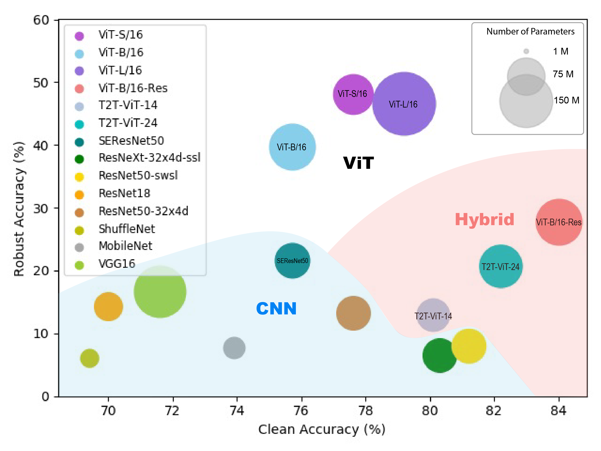

# On the Adversarial Robustness of Visual Transformer

Code for our paper "On the Adversarial Robustness of Visual Transformers"

Paper link: <a href="https://arxiv.org/abs/2103.15670"> https://arxiv.org/abs/2103.15670 </a>



## Evaluation
Install dependencies:

```bash
pip install -r requirements.txt
```

#### White-box attack test

To test adversarial robustness under white-box attack
```
python white_box_test.py --data_dir $DATA_DIR --mode foolbox --model vit_small_patch16_224
```
- The `--mode` flag decides the evaluation approach:
    - `--mode foolbox` applies a single attack (default: LinfPGD) for evalution.
    - `--mode auto` applies AutoAttack for evaluation.
    - `--mode foolbox-filter` applies the frequency-based attack for evaluation.
    - `--mode evaluate` evaluates the clean accuracy.
    - `--mode count` counts the number of parameters.

#### Black-box attack test

To test the transferability of adversarial examples generated by different models
```
python black_box_test.py --data_dir $DATA_DIR
```

## Adversarial training

Go to the training code:
```bash
cd training
```

Install dependencies:

```bash
pip install -r requirements.txt
```

Run: 

```bash
python train.py --dir {OUTPUT_DIR} --model vit_base_patch16_224_in21k --method {pgd|trades}
```

You may set `--accum-steps {N}' for gradient accumulation in case that GPU memory is not enough.
